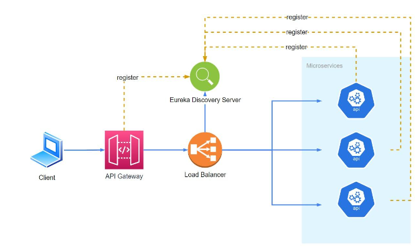

# MicroServices
## Table of Contents
I. [Creating the Eureka Service Discovery](#i-creating-the-eureka-service-discovery)  
II. [Creating the Client Service](#ii-creating-the-client-service)  
III. [Creating a Gateway Service](#iii-creating-a-gateway-service)  
IV. [Application Architecture](#iv-application-architecture)  
V. [Running the Application](#v-Running-the-application)  

## Objective
This tutorial aims to develop a comprehensive understanding of microservices architecture. Key aspects of this learning include creating and registering microservices, connecting to an in-memory H2 database, establishing a gateway service, and implementing synchronous communication between microservices using the OPENFEIGN tool.

In this tutorial, we adopt a microservices-based architecture, characterized by breaking down an application into small independent services. At the core of this structure are client microservices, autonomous entities that interact to provide a complete functionality. The API Gateway acts as a centralized entry point, simplifying request management by directing traffic to the appropriate microservices. The Eureka discovery server plays a crucial role by allowing each microservice to dynamically register, forming a decentralized directory of available services.

## I. Creating the Eureka Service Discovery
To create a service discovery, follow these steps:
1. Create a new project on Spring Initializr.
2. Add the following dependency: Eureka Server.
3. Configure the `application.properties` file:
``` 
server.port=8761
#not to register the server as a client
eureka.client.register-with-eureka=false
eureka.client.fetch-registry=false
```


# The database 

## II. Creating the Client Service
To create a client service, follow these steps:

Create a new project on Spring Initializr.

Add the following dependencies: Spring Boot Actuator, Eureka Discovery Client, H2, Spring Data JPA, Spring Web, Spring Boot Devtools, Rest Repositories, Lombok.

Configure the application.properties file:
```
server.port=8088
spring.application.name=clients

spring.datasource.url=jdbc:mysql://localhost:3306/client
spring.datasource.username=root
spring.datasource.password=

spring.jpa.properties.hibernate.dialect=org.hibernate.dialect.MySQLDialect
spring.jpa.hibernate.ddl-auto=update
```
And add the proper classes to fetch data from the database.


## III. Creating the car (Voiture) Service

To create a gateway service, follow these steps:

Create a new project on Spring Initializr.

Add the following dependencies: Spring Cloud Routing Gateway, Spring Boot Actuator, Eureka Discovery Client.

Configure the application.properties file: 
```
server.port=8089
spring.application.name=voitures

spring.datasource.url=jdbc:mysql://localhost:3306/client
spring.datasource.username=root
spring.datasource.password=

spring.jpa.properties.hibernate.dialect=org.hibernate.dialect.MySQLDialect
spring.jpa.hibernate.ddl-auto=update
```


## IV. Application Architecture:


The overall architecture follows microservices principles, where each service is an independent, deployable unit.
Services communicate with each other over HTTP protocols, and OPENFEIGN is used for service-to-service communication.
Eureka enables service discovery and registration.
The H2 in-memory database is used for simplicity in data storage for the SERVICE-CLIENT and SERVICE-VOITURE microservices.
The Gateway service handles routing and acts as the entry point for external clients.

## V. Running the Application

Start the Eureka service discovery by running the EurekaServerApplication.
Run the ClientApplication, GatewayApplication, and VoitureApplication services.

* Access the Eureka dashboard at http://localhost:8761/ to view registered services.
* Use the Gateway service (http://localhost:8888/) to interact with the microservices.

This microservices architecture demonstrates key concepts, including service discovery, API gateway, service-to-service communication, and data association between microservices. The usage of Spring Boot simplifies the development and deployment of microservices within the application.
